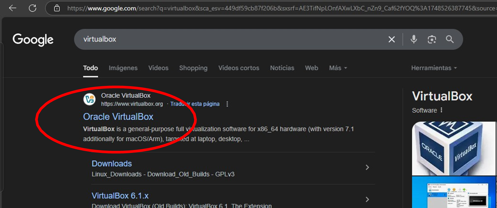

# 🚀 Proyecto: Trabajo Integrador de Virtualización

## 🧠 Descripción

Este proyecto consiste en una práctica integradora que combina el uso de **VirtualBox**, **Ubuntu** y **Python** para aplicar conceptos de virtualización y administración de sistemas operativos. Se diseñó un entorno virtual que simula un escenario de uso real y se desarrollaron scripts para automatizar tareas dentro del sistema huésped.

---

## 🗂️ Estructura del Proyecto

📁 src/   → Código usado en el proyecto  
📁 img/   → Capturas de pantalla del funcionamiento  
📁 docs/  → Informe del proyecto (PDF)  
📄 README.md → Este archivo

---

## ⚙️ Cómo Ejecutarlo

1. Clonar o descargar el repositorio.
2. Abrir la carpeta `src/`.
3. Ejecutar el archivo principal del proyecto dentro de la máquina virtual Ubuntu:

   - 🐍 Ejecutar: `python3 Tp-Integrador.py`

📌 Asegurarse de tener Python instalado en Ubuntu.  
📌 La máquina virtual se ejecuta con VirtualBox.

---

## 🖼️ Capturas de Pantalla

Las imágenes que muestran el funcionamiento del sistema están en la carpeta `img/`.

> Ejemplo:  
> 

---

## 📄 Informe

📍 El informe técnico se encuentra en `docs/Trabajo Integrador - Virtualización - Fabian Cardozo, Lautaro Cejas - COM 11.pdf` e incluye detalles de la implementación, decisiones de diseño y resultados obtenidos.

---

## 👥 Autores

- 👨‍💻 Fabian Ignacio Cardozo 
- 👨‍💻 Lautaro Ariel Cejas

📚 Curso: Arquitectura de Sistemas Operativos  
🎓 Profesor: Diego Lobos  
📅 Fecha de entrega: 05/06/2025
